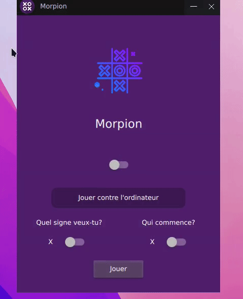

</a>

 

<h2 style="font-family: sans-serif; font-weight: normal;" align="center"><strong>Morpion (tic tac toe)</strong> avec une interface graphique</h2>

 

## Gameplay

</a>

## Dépendance

- PySide6

## Usage

Clone le repo, et ...

- `cd Morpion_Tic-Tac-Toe/`
- `pip install -r requirements.txt`
- `python main.py`

## Règle

Deux joueurs posent tour à tour un rond, pour l’un, une croix, pour l’autre, dans une grille de 3 cases par 3. Le but du jeu est d’obtenir un alignement (en ligne, colonne ou diagonale) de ses trois signes.
Bonne chance!
